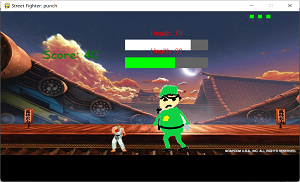
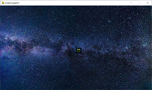

# VSA Programming Club Website

This website contains resources and programming examples that will be helpful.

## 2022-2023

[HTML programming](html)

[JavaScript programming](javascript)

[PHP programming](php)

## 2021-2022

[Installing Python](installing_python)

* Hello World [download](python/hello_world.py) [github](https://github.com/davidmerickson01/davidmerickson01.github.io/tree/master/python/hello_world.py)
* Final Exam Prioritizer [download](python/final_exam_prioritizer.py) [github](https://github.com/davidmerickson01/davidmerickson01.github.io/tree/master/python/final_exam_prioritizer.py)
* Football [download](python/football.py) [github](https://github.com/davidmerickson01/davidmerickson01.github.io/tree/master/python/football.py)

Street Fighter source code [download](https://download-directory.github.io/?url=https://github.com/davidmerickson01/davidmerickson01.github.io/tree/master/python/street_fighter
) [github](https://github.com/davidmerickson01/davidmerickson01.github.io/tree/master/python/street_fighter)

## 2020-2021

[Arduino programming](arduino)

[JavaScript canvas programming](javascript_canvas)

## 2019-2020

Python and Pygame

After downloading a zip file, you need to extract (or unzip) by right-clicking on the file before running.

Simple Pygame source code [download](https://download-directory.github.io/?url=https://github.com/davidmerickson01/davidmerickson01.github.io/tree/master/python/simple_pygame
) [github](https://github.com/davidmerickson01/davidmerickson01.github.io/tree/master/python/simple_pygame)

Simple Mario source code [download](https://download-directory.github.io/?url=https://github.com/davidmerickson01/davidmerickson01.github.io/tree/master/python/simple_mario
) [github](https://github.com/davidmerickson01/davidmerickson01.github.io/tree/master/python/simple_mario)
