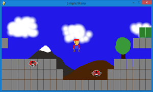

# VSA Programming Club Website

This website contains resources and programming examples that will be helpful.

## 2021-2022

[Installing Python](installing_python)

Click on these to download, then run them.

* [Hello World](python/hello_world.py)
* [Final Exam Prioritizer](python/final_exam_prioritizer.py)
* [Football](python/football.py)

## 2020-2021

[Arduino programming](arduino)

[JavaScript programming](javascript)

## 2019-2020

Python and Pygame

[Simple Mario source code](https://github.com/davidmerickson01/davidmerickson01.github.io/tree/master/python/simple_mario)
